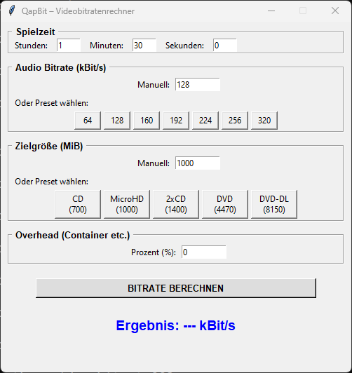

# QapBit #

Videobitratenrechner


**QapBit** berechnet die Videobitrate. Dieser Wert wird für Videcodecs z. B. bei der *variablen Bitrate* angegeben. – Die Bitrate kann zwar berechnet werden, jedoch schwankt die reale Bitrate je nach verwendetem Codec und Ausgangsmaterial. Daher kann dieser Wert nur einen ungefähren Richtwert darstellen.

> QapBit – „Qap“ bedeutet „funktionieren“ → „funktionierende Bitrate“

---

## Funktion ##

Ein kleines Tool zur Berechnung der Videobitrate.

- Berechnung basierend auf Zielgröße (MiB) und Dauer.
- Berücksichtigung von Audio-Bitrate und Container-Overhead.
- Verschiedene Presets für gängige Medien.

---

## Screenshot ##



---

## Installation/Ausführen ##

### Alle OS ###

Nachdem [Python](https://www.python.org/) für das jeweilige Betriebssystem installiert wurde kann die Datei "qapbit.py" ausgeführt werden:

```
python qapbit.py
```

### Windows ###

In Windows kann das Programm zu einer EXE-Datei kompiliert werden.

1. Pyinstaller via *PIP* installieren:

```
pip install pyinstaller
```

2. Mit *Pyinstaller* kompilieren:

```
pyinstaller --onefile --windowed qapbit.py
```

Anschließend ist dei EXE-Datei im Unterordner ``\dist`` auffindbar.

---

## Lizenzen ##

Folgende Lizenzen sind zu beachten:

### Eigener Code ###

GNU GENERAL PUBLIC LICENSE Version 3

### Externe Quellen ###

Folgende externe Quellen wurden genutzt:

#### Grafiken ####

- https://openmoji.org/

#### Fonts ####

- [Liberation Fonts](https://github.com/liberationfonts/liberation-fonts)
- [Fira Code](https://github.com/tonsky/FiraCode)
